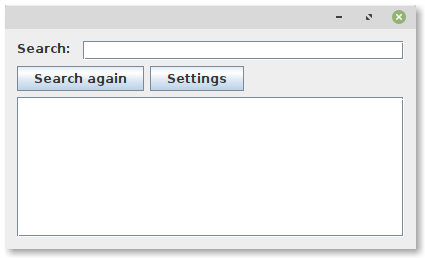
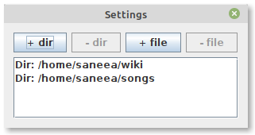
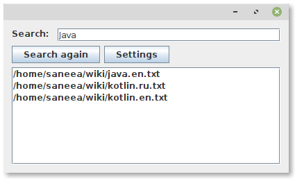

# file-indexer
Simple file indexer which allows searching text files by keywords.

# 1. Build

Unix:
```shell
cd ./shell
./build.sh
```
Windows:
```shell
cd .\shell
.\build.bat
```

As the result you should observe output which ends like that:

```
...
[INFO] ------------------------------------------------------------------------
[INFO] Reactor Summary for indexer-modules 0.0.1-SNAPSHOT:
[INFO] 
[INFO] indexer-core ....................................... SUCCESS [ 11.739 s]
[INFO] indexer-client ..................................... SUCCESS [  3.149 s]
[INFO] indexer-modules .................................... SUCCESS [  0.012 s]
[INFO] ------------------------------------------------------------------------
[INFO] BUILD SUCCESS
[INFO] ------------------------------------------------------------------------
[INFO] Total time:  15.053 s
[INFO] Finished at: 2021-04-18T01:21:50+03:00
[INFO] ------------------------------------------------------------------------
```

# 2. Run

Unix:
```shell
./run-ui.sh
```
Windows:
```shell
.\run-ui.bat
```

As the result you should observe the main window:



# 3. Add directories/files for indexing

Click on "Settings" button on the main window in order to open "Settings" window. Add/remove directories/files using UI buttons ([+/-][dir/file]).
You can find some test files in directory `test-files`



# 4. Try to search some word in indexed files

Type word in UI input and observe the list of files which contain the word



# 5. Try to change indexed files

Add/remove/modify files in directories (which you have added in the step 3)
The core of **file-indexer** picks up the changes and update the index.
Type again the word for searching or just click "Search again" button.
As the result you should observe changed file list.